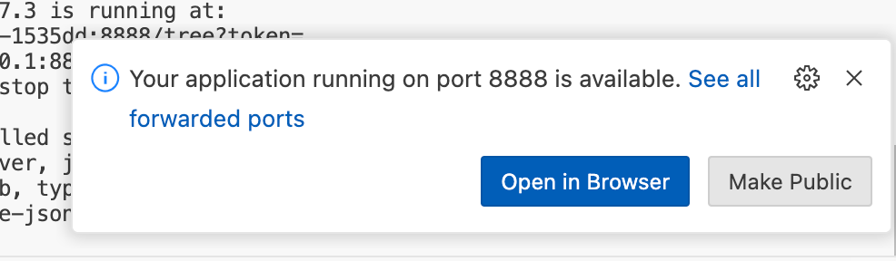
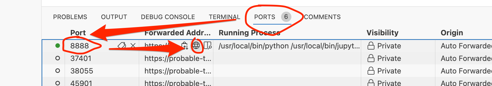
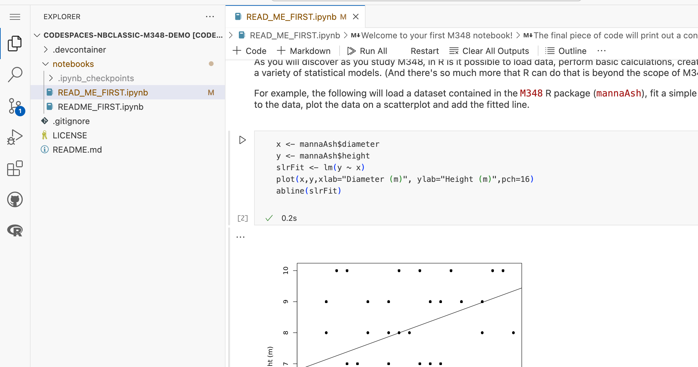

# M348 Environment in Github Codespaces Demo

Demo of running an OU maintained Docker container as the computational environment (requires GitHub account).

To run:

- (clone this repository)
- from the repository Code / Codespaces menu, launch a new Codespace with a VS Code user interface; *if you have a stopped environment, then you can start it again, and seleect "Open in browser" to launch the VS Code interface.*
- when the Codespace has loaded, from the VS Code terminal, run the command: `start.sh`; when prompted, click to "Open in browser" to launch the Jupyter notebook server.

Use the password `M348-23J` to access the environment.

You can also launch the browser from the *Ports* tab: in the row that maps port 8888, hover you mouse ober the forwarded addresses item, and click the globe icon to launch the window.

*You can optionally run the notebooks in the VS Code interface.*

## End-User Rationale

The demo is interesting for several reasons:

- a custom container can be provided that defines a complex computational environment for use in the Codespace. In the current example, the container is a container used in the Open University module *M348*. This environment includes:
  - a classic Jupyter notebook server, customised using off-the-shel extensions;
  - an R environment with required packages pre-installed;
  - __we can deliver a complex computational environment to students that we can update as required by updating the original Docker image__
  
- Codespaces provide a generous amount of free hosted compute hours per month, meaning an install free user experience;
  - __students can use the Codespaces environment for free without any hosting burden on, or costs to, the OU__

- the editing environment is separate from the containerised computational environment. Codespaces can be used to provide install free, customisable, browser based VS Code and nbclassic Jupyter notebook environments:
  - the VS Code editor can be customised by installing additional extensions via the `devcontainer.json` file;
  - __we can separate concerns of delivering a customised computational environment (via the Docker image) and a customised user editing environment (via `.devcontainer` config files in the repo)__

- file edits can be persisted in a Github repository using the VS Code git extension. (Modified files are persisted in the container and can also be published to a new branch);
  - __provides a natural rationale for getting students into the habit of using version control / git__
  - __NOTE THAT THE REPOSITORY IS PUBLIC: I'M NOT SURE IF YOU CAN WORK WITH PRIVATE REPOS FOR FREE IN DEVSPACES. IF YOU CAN, YOU WILL NEED TO CREATE A PRIVATE REPO AND COPY THE `.devcontainer/devcontainer.json` FILE FROM THIS REPO INTO IT.__
